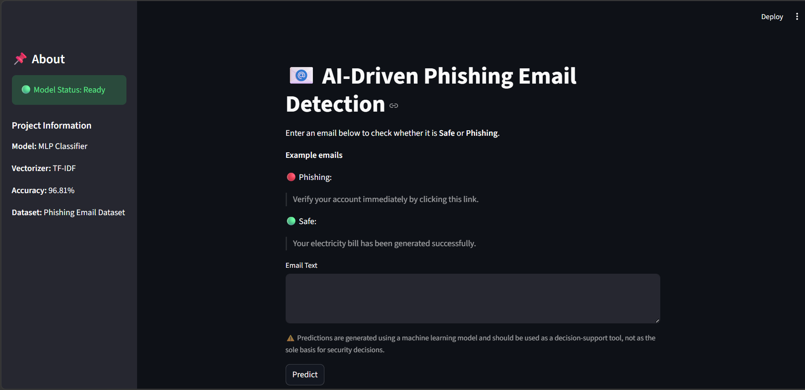
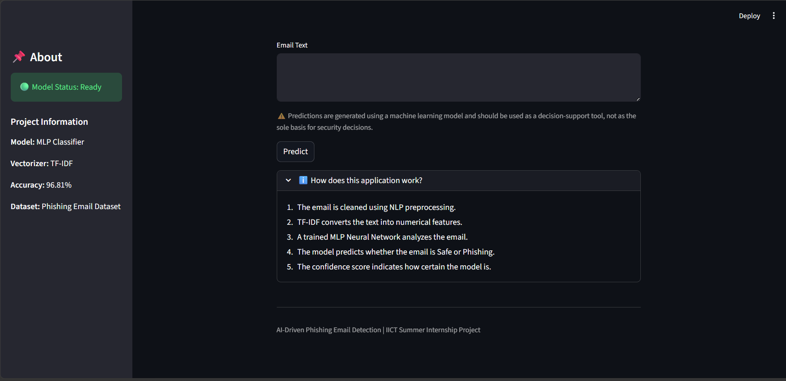
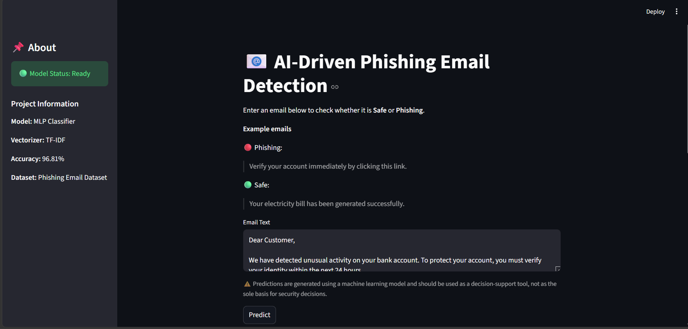
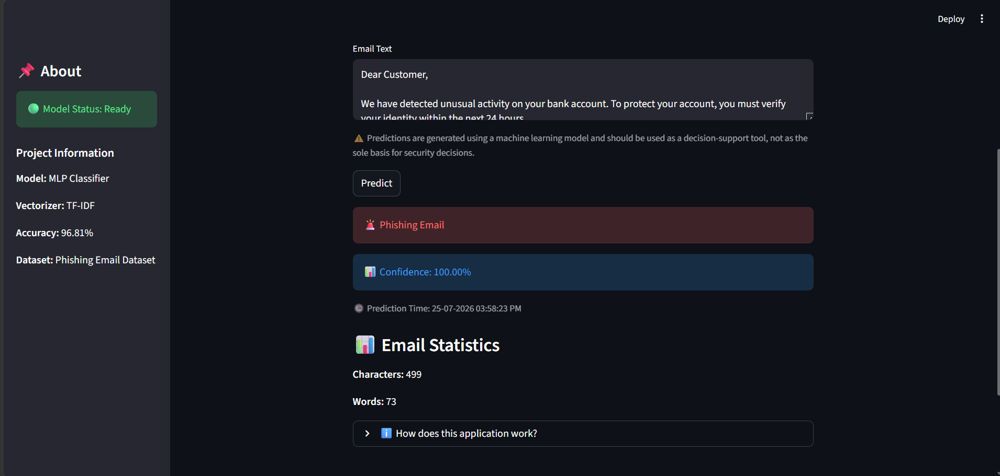
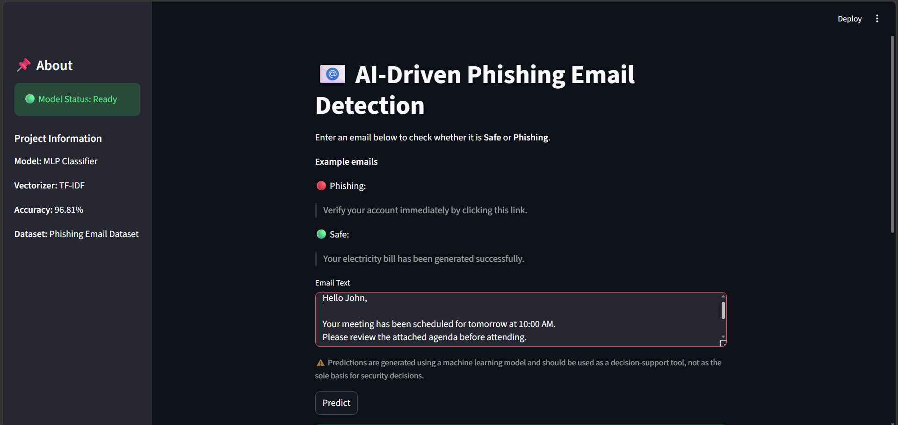
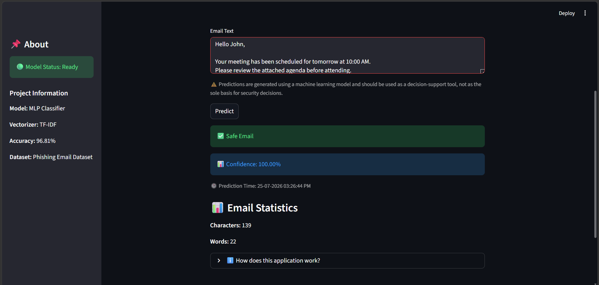
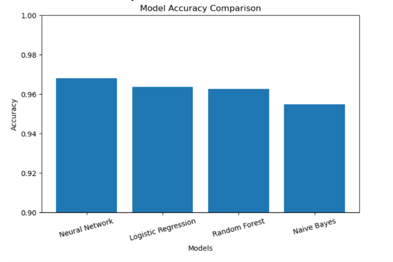
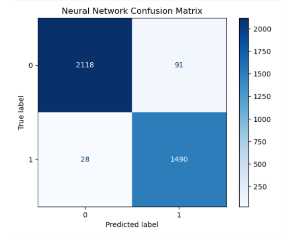

# 📧 AI-Driven Phishing Email Detection Using NLP

## 📌 Project Overview

This project is a Machine Learning and Natural Language Processing (NLP) based web application that detects whether an email is **Safe** or **Phishing**. The system preprocesses email text, extracts features using TF-IDF, and classifies emails using multiple machine learning algorithms. A Streamlit web application provides an easy-to-use interface for real-time prediction.

---

## ✨ Features

- Detects phishing and legitimate emails
- NLP-based text preprocessing
- TF-IDF feature extraction
- Multiple machine learning models
- Model comparison
- Confidence score for predictions
- Email statistics (character and word count)
- Prediction timestamp
- Professional Streamlit web interface

---

## 🛠 Technologies Used

- Python
- Pandas
- NumPy
- Scikit-learn
- NLTK
- Matplotlib
- Joblib
- Streamlit

---

## 📂 Dataset

**Dataset:** Phishing Email Dataset (Kaggle)

The dataset contains phishing and legitimate email samples used for training and evaluating the machine learning models.

---

## 🧹 Data Preprocessing

The following preprocessing techniques were applied:

- Convert text to lowercase
- Remove URLs
- Remove HTML tags
- Remove punctuation
- Remove numbers
- Remove stopwords
- Word lemmatization

---

## 📊 Feature Extraction

The cleaned email text is converted into numerical features using:

- **TF-IDF Vectorizer**
- Maximum Features: **5000**

---

## 🤖 Machine Learning Models

The following models were trained and evaluated:

- Naive Bayes
- Logistic Regression
- Random Forest
- Multi-Layer Perceptron (MLP Neural Network)

---

## 📈 Model Performance

| Model | Accuracy |
|--------|----------|
| Naive Bayes | 95.47% |
| Logistic Regression | 96.35% |
| Random Forest | 96.24% |
| MLP Neural Network | **96.81%** |

The **MLP Neural Network** achieved the highest accuracy and was selected as the final model.

---

## 🖥 Streamlit Application

The application allows users to:

- Enter email text
- Detect phishing emails instantly
- View prediction confidence
- View prediction timestamp
- View email statistics
- Learn how the model works

---

## 📁 Project Structure

```
AI-Driven-Phishing-Email-Detection/
│
├── dataset/
├── model/
│   ├── phishing_model.pkl
│   └── tfidf_vectorizer.pkl
│
├── app.py
├── phishing_detection.ipynb
├── requirements.txt
├── README.md
└── .gitignore
```

---

## ⚙ Installation

Clone the repository:

```bash
git clone <repository-link>
```

Install dependencies:

```bash
pip install -r requirements.txt
```

Run the application:

```bash
streamlit run app.py
```

---


## 📸 Screenshots

### Home Page





### Phishing Prediction





### Safe Email Prediction





### Model Comparison



### Confusion Matrix



---

## 🚀 Future Improvements

- Deep Learning using LSTM/BERT
- URL analysis
- Sender domain verification
- Email attachment scanning
- Cloud deployment

---

## 📜 License

This project was developed for educational purposes as part of the **IICT Summer Internship Project**.